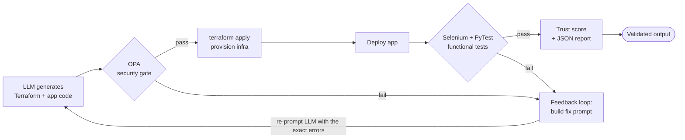

# LLM-Gate

> A validation pipeline that gates AI-generated code and infrastructure before it ships. LLM output is security-scanned (OPA), functionally tested (Selenium + PyTest), scored for trust, and, when it fails, automatically re-prompted and fixed until it passes.

[](https://github.com/codebyanjaneya/LLM-Gate/actions/workflows/ci.yml)


---

## The Problem

Developers increasingly ship application code and Terraform straight from LLMs (Claude, GPT, Copilot) with minimal review. This "vibe-coded" output regularly hides security gaps such as `0.0.0.0/0` security groups, unencrypted volumes, public S3 buckets, and over-permissive IAM, plus untested functionality that only surfaces during a production incident. LLM-Gate sits between AI output and deployment as a guardrail: it proves the infrastructure is secure and the app actually works before anything goes live.

## What It Does



Every stage is interdependent, not a set of isolated demos. Any failure at the security gate or the functional tests is packaged into a structured fix prompt and sent back to the LLM, which regenerates the offending files. The loop repeats until the trust score hits 100% or the retry budget runs out.

## Key Features

- **5 OPA security policies:** Rego rules that scan the Terraform plan for open security groups, unencrypted root volumes, missing resource tags, public S3 ACLs, and SSH exposed to the world.
- **7 functional tests:** Selenium + PyTest covering login, auth redirects, session handling, page rendering, and a security test that catches an exposed Werkzeug debugger (`debug=True`).
- **Self-correcting auto-fix loop:** failures become a fix prompt for a Groq-hosted Llama 3.3 70B model that rewrites the files. Invalid Terraform (for example a placeholder CIDR) is caught by `terraform validate` and fed back so the LLM corrects its own mistake on the next attempt.
- **Trust score system:** `(passing checks / total checks) * 100`, written to a JSON report with a full pass/fail breakdown and per-run score history.
- **Safe by design:** LLM writes are restricted to an allowlist (path-traversal guard), originals are backed up before every overwrite, and secrets stay in a gitignored `.env`.

## Tech Stack

| Tool | Role in the pipeline |
|------|----------------------|
| **Terraform** | Provisions the AI-generated infrastructure |
| **OPA / Rego** | Policy-as-code security gate on the Terraform plan |
| **Selenium** | Browser automation for functional tests |
| **PyTest** | Test runner and machine-readable JSON reporting |
| **Groq (Llama 3.3 70B)** | LLM that generates and auto-fixes the code and infra |
| **Flask** | Sample application under test |
| **Python** | Orchestration and glue between every stage |

## Demo

<!-- TODO: replace with a terminal recording GIF -->
<!--  -->
_A terminal recording will go here._

Real run: the LLM's first fix produced an invalid CIDR placeholder, the pipeline caught it, fed the terraform error back, and the model self-corrected to reach a perfect trust score.

```text
$ python orchestrator.py --max-retries 3

STAGE 1  terraform plan + OPA security gate ....... FAIL (policy violations)
STAGE 2  Selenium + PyTest functional tests ....... FAIL (debug=True exposed)
STAGE 3  Trust score .............................. 86.7%

AUTO-FIX ATTEMPT 1/3  ->  LLM regenerates infra/main.tf + sample_app.py
   x terraform plan invalid: "your_ip_address/32" is not a valid CIDR block
   -> feeding the terraform error back to the LLM to self-correct

AUTO-FIX ATTEMPT 2/3  ->  (previous terraform error included in the prompt)
   LLM corrects the CIDR (e.g. 10.0.0.0/16) and re-runs
   OPA gate: PASS   |   functional tests: PASS

============================================================
 PIPELINE SUMMARY
   Attempts used : 2/3
   Trust score   : 86.7%  ->  100.0%
   Status        : ALL CLEAR (100%)
============================================================
```

## Quick Start

Prerequisites: Python 3.11+, [Terraform](https://developer.hashicorp.com/terraform/install), [OPA](https://www.openpolicyagent.org/docs/latest/#running-opa), and Google Chrome (for Selenium). A [Groq API key](https://console.groq.com/keys) is optional; without it the pipeline runs in detect-only mode.

```bash
# 1. Clone
git clone https://github.com/codebyanjaneya/LLM-Gate.git
cd LLM-Gate

# 2. Create and activate a virtual environment
python -m venv venv
venv\Scripts\activate          # Windows
# source venv/bin/activate     # macOS / Linux

# 3. Install dependencies
pip install -r requirements.txt

# 4. Initialize Terraform (downloads the AWS provider)
terraform -chdir=infra init

# 5. (Optional) enable the LLM auto-fix loop
copy .env.example .env         # then add your GROQ_API_KEY

# 6. Run the full pipeline
python orchestrator.py --max-retries 3
```

Handy variants:

```bash
python orchestrator.py --max-retries 0        # detect-only, no auto-fix
python policies/run_check.py                  # just the OPA security gate
pytest -m security                            # just the security test
```

## Project Structure

```text
LLM-Gate/
├── orchestrator.py           # Runs the full pipeline + self-correcting retry loop
├── generator/
│   └── sample_app.py         # Flask app under test (with a planted debug=True flaw)
├── infra/
│   └── main.tf               # AI-generated Terraform (with planted misconfigs)
├── policies/
│   ├── main.rego             # 5 OPA security policies (package terraform.security)
│   └── run_check.py          # Policy gate: terraform plan -> opa eval
├── tests/
│   ├── conftest.py           # Headless Chrome fixture (webdriver-manager)
│   └── test_app.py           # 7 Selenium + PyTest functional tests
├── feedback/
│   └── regenerate.py         # Fix-prompt builder + Groq LLM auto-fix
├── reports/
│   ├── trust_score.py        # Trust score calculator -> report.json
│   └── report.json           # Latest run report (generated)
├── requirements.txt
├── .env.example
├── .gitignore
├── LICENSE
└── README.md
```

## Why This Project Is Interesting

Most tools generate code with AI. LLM-Gate uses one AI system to validate and repair the output of another, a fresh and largely unexplored angle. The novel part is the closed feedback loop: when the model emits code that is insecure, non-functional, or even syntactically invalid, the exact failure (an OPA violation, a failing test, or a real `terraform validate` error) is routed back into the next prompt so the model can self-correct, with a measurable trust score proving whether it worked.

## Roadmap

- [ ] Package as an installable `llm-gate` CLI (pipx)
- [ ] VS Code extension to gate AI output inline before commit
- [ ] More OPA policies (IAM least-privilege, public S3, tagging and cost guards)
- [ ] LocalStack / Docker path for a zero-cloud demo
- [ ] Pluggable LLM providers (OpenAI, Claude, local models)
- [ ] GitHub Action to run the gate in CI

## License

Released under the [MIT License](LICENSE).
